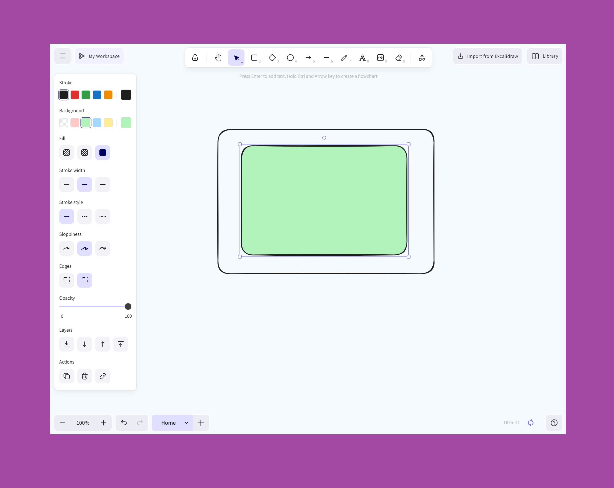

# Mycelium


A self-hostable version of Excalidraw with multi-tab support and Google Drive sync, inspired by the original work of [MontejoJorge](https://github.com/MontejoJorge/excalidraw-multi-tabs).




## 🎨 Features

✨ **Multi-Tab Support** - Work with multiple drawings simultaneously  
🗂️ **Workspaces** - Organize tabs into workspaces, each backed by its own Google Drive folder  
🎨 **Full Excalidraw Experience** - All the power of Excalidraw in a tabbed interface  
📥 **Import from Excalidraw** - Seamlessly import existing Excalidraw drawings  
💾 **Local Storage** - Your work is automatically saved locally  
☁️ **Google Drive Sync** - Auto-save and restore your tabs from Google Drive  
🚀 **Self-Hostable** - Host it yourself for complete control  
🖼️ **Image Support** - Add images to your drawings

## ☁️ Google Drive Sync Setup

Google Drive sync is optional. When enabled, each tab is automatically saved as a `.excalidraw` file in a **Mycelium** folder in the user's Google Drive.

### 1. Google Cloud Console

1. Create a project and enable the **Google Drive API**
2. Go to **APIs & Services → OAuth consent screen**:
   - Add scope `https://www.googleapis.com/auth/drive.file`
   - Add scope `openid email`
   - Add your domain as an authorized domain
3. Go to **Credentials → Create OAuth client ID**:
   - Application type: **Web application**
   - Authorized JavaScript origins: your app domain
   - Authorized redirect URIs: your app domain

### 2. Backend (token exchange)

Google requires a backend to securely exchange the OAuth auth code for an access token. Your backend needs one endpoint:

```
POST /mycelium/auth/token
Body: { "code": "...", "redirect_uri": "..." }
Returns: { "access_token": "...", "expires_in": 3600 }
```

It should exchange the code with Google using your `GOOGLE_CLIENT_ID` and `GOOGLE_CLIENT_SECRET`.

### 3. Frontend build variables

```
VITE_GOOGLE_CLIENT_ID=your-client-id
VITE_API_URL=https://your-backend-domain
```

---

## 🚧 Current Limitations

- [ ] **Link Sharing** – Not possible to share a direct link to a drawing

## 🤝 Contributing

Contributions are welcome! Please feel free to submit a Pull Request.

1. Fork the repository
2. Create your feature branch (`git checkout -b feature/amazing-feature`)
3. Commit your changes (`git commit -m 'Add some amazing feature'`)
4. Push to the branch (`git push origin feature/amazing-feature`)
5. Open a Pull Request

## 📄 License

This project is licensed under the MIT License - see the [LICENSE](LICENSE) file for details.
